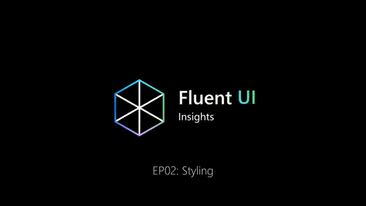
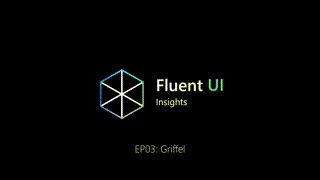

<!-- DOCTOC SKIP -->

<div align="center">
  <picture>
    <source media="(prefers-color-scheme: dark)" srcset="./ghdocs/images/griffel-light.png">
    
  </picture>
</div>

<h2 align="center">CSS-in-JS with ahead-of-time compilation ⚡️</h2>
<p align="center">
  <a href="https://www.npmjs.com/package/@griffel/react">
    
  </a>
  
  <a href="https://github.com/microsoft/griffel/discussions">
    
  </a>
</p>

Griffel ([_German for stylus/pen_](https://en.wiktionary.org/wiki/Griffel)) is CSS-in-JS with near-zero runtime, SSR support and styles defined with JavaScript objects.

🚀 &nbsp; Zero config start: Griffel has both runtime & build time implementations

🔥 &nbsp; Optional [build time transforms](./packages/webpack-loader) to improve performance

💪 &nbsp; Type-safe styles via [csstype](https://github.com/frenic/csstype)

🧩 &nbsp; Uses Atomic CSS to reuse styles and avoid specificity issues with CSS

📝 &nbsp; _Experimental_ CSS extraction with [Webpack plugin](./packages/webpack-extraction-plugin)

🐞 &nbsp; Debug using [Griffel DevTools extension](https://chrome.google.com/webstore/detail/griffel-devtools/bejhagjehnpgagkaaeehdpdadmffbigb)

### Griffel with React

```bash
npm install @griffel/react
# or
yarn add @griffel/react
```

- [Quick start](https://griffel.js.org/react/install)
- [API guide](https://griffel.js.org/react/api/make-styles)
- [README](./packages/react)

## Learn more?

Check series episodes of Fluent UI Insights related to styling issues and Griffel 🎥

|                                                                                                           EP02: Styling                                                                                                           |                                                                                                           EP03: Griffel                                                                                                           |
| :-------------------------------------------------------------------------------------------------------------------------------------------------------------------------------------------------------------------------------: | :-------------------------------------------------------------------------------------------------------------------------------------------------------------------------------------------------------------------------------: |
| <a href="https://learn.microsoft.com/en-us/shows/fluent-ui-insights/fluent-ui-insights-styling?utm_source=github" target="_blank"></a> | <a href="https://learn.microsoft.com/en-us/shows/fluent-ui-insights/fluent-ui-insights-griffel?utm_source=github" target="_blank"></a> |

## Contributing

This project welcomes contributions and suggestions, please see [CONTRIBUTING.md](./CONTRIBUTING.md) to get started.

## Trademarks

This project may contain trademarks or logos for projects, products, or services. Authorized use of Microsoft
trademarks or logos is subject to and must follow
[Microsoft's Trademark & Brand Guidelines](https://www.microsoft.com/en-us/legal/intellectualproperty/trademarks/usage/general).
Use of Microsoft trademarks or logos in modified versions of this project must not cause confusion or imply Microsoft sponsorship.
Any use of third-party trademarks or logos are subject to those third-party's policies.

## License

This project is licensed under the MIT License, see the [LICENSE.md](LICENSE.md) file for details.
