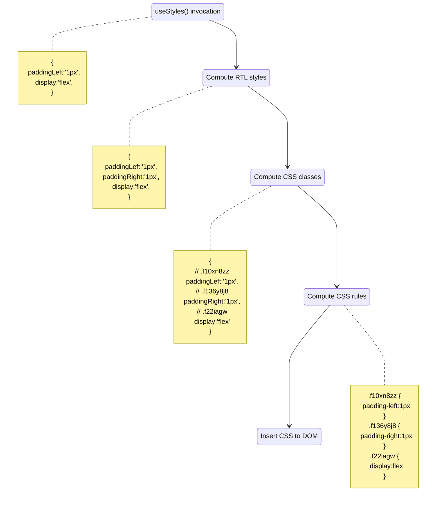

# Technical details

## What is being optimized with AOT (Ahead Of Time) compilation?

:::info

Style resolution only needs to happen on the initial render of a component. Therefore, without build time optimization the performance is comparable with the 2nd and consecutive renders.

It is reasonable to introduce build time optimization if/when it is required.

:::

```jsx
import { makeStyles } from '@griffel/react';

// 1. Invocation of makeStyles creates a styling hook that will be used inside a component.
const useStyles = makeStyles({
  root: { paddingLeft: '1px', display: 'flex' },
});

function Component() {
  // 2. The hook call resolves styles which are injected into the document.
  const classes = useStyles();

  return <div className={classes.root} />;
}
```

You can look at the graph below which describes what work is done during style resolution:



:::note

This work only happens once, during first render.

:::

The final result before the CSS rules are inserted into DOM can be compiled ahead of time during build time through the methods described above.
Once the styles of our simple example are transformed at build time the resulting bundle contains a result similar to what is in our diagram.

The actual runtime code of `makeStyles` is completely stripped from the bundle and replaced with a lightweight function (`__styles`) that simply concatenates the CSS classes and inserts them to DOM.

```jsx
const useStyles = __styles(
  {
    root: {
      mc9l5x: 'f22iagw',
      uwmqm3: ['f10xn8zz', 'f136y8j8'],
    },
  },
  {
    d: ['.f22iagw{display:flex;}', '.f10xn8zz{padding-left:1px;}', '.f136y8j8{padding-right:1px;}'],
  },
);

function Component() {
  const classes = useStyles();

  return <div className={classes.root} />;
}
```

## Module evaluation process

Let's consider the following scenario:

```js
// constants.js
export const PADDING_TOKEN = '1px';
```

```js
// common.js
export const commonStyles = () => ({
  display: 'flex',
  justifyContent: 'center',
  alignItems: 'center',
});
```

```js
// styles.js
import { makeStyles } from '@griffel/react';
import { PADDING_TOKEN } from './constants';
import { commonStyles } from './common';

const useStyles = makeStyles({
  root: { paddingLeft: PADDING_TOKEN, ...commonStyles() },
});
```

It's perfectly fine, and even recommended to reuse common tokens and create style helpers across an application.
It's one of the main benefits of using CSS-in-JS.

However, this means that the build time transforms which are described above are not trivial to compute because code needs to be evaluated to know what styles to transform.
In the example above, in order to transform the `styles.js` file, the code needs to be executed/evaluated by importing the extra modules that it depends on (`constants.js` and `common.js`).

Griffel uses style evaluation from [Linaria](https://linaria.dev/).
The build-time evaluation happens as a part of the Babel transforms in Griffel. All styles that require evaluation will be batched and done in single evaluation context.
Linaria's Babel config is separate to any config used by the application.
Therefore, additional language features may require [extra configuration](/react/ahead-of-time-compilation/with-webpack#configuration).
