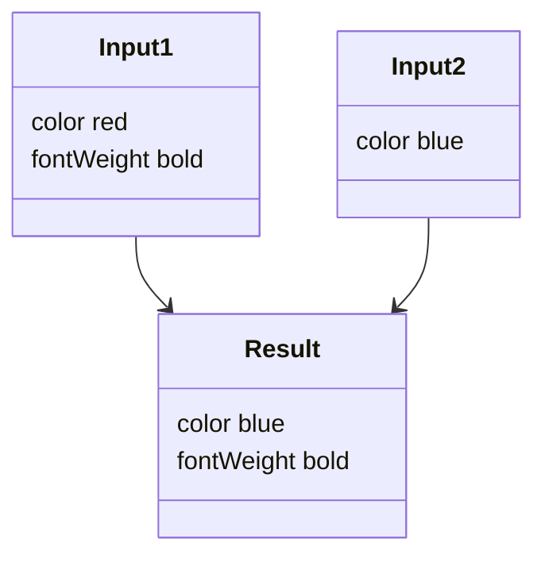

import OutputTitle from '@site/src/components/OutputTitle'

# mergeClasses

There are cases where you need to merge classes from multiple `useClasses` calls. To merge the classes correctly, you need to use `mergeClasses()` function, which merges and dedupes the atomic classes generated by `makeStyles()`.

```jsx
import { mergeClasses, makeStyles } from '@griffel/react';

const useClasses = makeStyles({
  blueBold: {
    color: 'blue', // className "color-blue"
    fontWeight: 'bold', // className "font-weight-bold"
  },
  red: {
    color: 'red', // className "color-red"
  },
});

function Component(props) {
  const { isBold } = props;
  const classes = useClasses();

  // ℹ️ Order of arguments determines the results

  const firstClassName = mergeClasses(isBold && classes.blueBold, classes.red);
  // 👆 { color: 'red', fontWeight: 'bold' }
  //    className "color-red font-weight-bold"
  const secondClassName = mergeClasses(classes.red, isBold && classes.blueBold);
  // 👆 { color: 'blue', fontWeight: 'bold' }
  //    className "color-blue font-weight-bold"
}
```

:::note



Compared to native CSS, the order of arguments in `mergeClasses()` affects the results. This lets you control styles with JavaScript.

:::

In CSS the order of the class names doesn't affect the application of styles. If you have issues with style specificity or ordering, look at the generated CSS rather than the class names.

Griffel performs CSS rule ordering, check [the order of pseudo classes](react/guides/atomic-css#lvfha-order-of-pseudo-classes).

### Merging plain CSS classes

Your component may accept classes via props or have static classes that you need applied to the same elements being styled by Griffel. For this, you can also use `mergeClasses`:

```jsx
import { mergeClasses, makeStyles } from '@griffel/react';

const useClasses = makeStyles({
  setA: {},
  setB: {},
});

function Component() {
  const classes = useClasses();

  // ℹ️ Non-atomic class names will be first and followed by the new class names

  const className = mergeClasses('foo', classes.setA, classes.setB, 'bar');
  // 👆 className "foo bar ...atomic classes..."
}
```

## Incorrect usages

This section shows and describes anti-patterns which should never be used.

### Never concatenate class strings

:::caution

It is not possible to simply concatenate classes returned by `useClasses()` hooks. Always use `mergeClasses()` to merge classes as results of concatenation can contain duplicated classes and lead to non-deterministic results.

:::

```jsx
const useClasses = makeStyles({
  rootA: { color: 'red' },
  rootB: { color: 'blue' },
});

function App(props) {
  const classes = useClasses();

  // ✅ Returns "class-color-blue"
  const correctClasses = mergeClasses(classes.rootA, classes.rootB);
  // 🔴 Never concatenate class strings, returns "class-color-red class-color-blue"
  const wrongClasses = classes.rootA + ' ' + classes.rootB;
}
```

### Order of arguments matters

The order of classes is important - if two classes apply the same style, the latest class wins. In the example below the background color will be red:

```jsx
const useClasses = makeStyles({
  root: { color: 'red' },
});

function Component(props) {
  const classes = useClasses();
  // 💥 Incorrect order of classes
  const wrongClasses2 = mergeClasses(props.className, classes.root);
}
```
