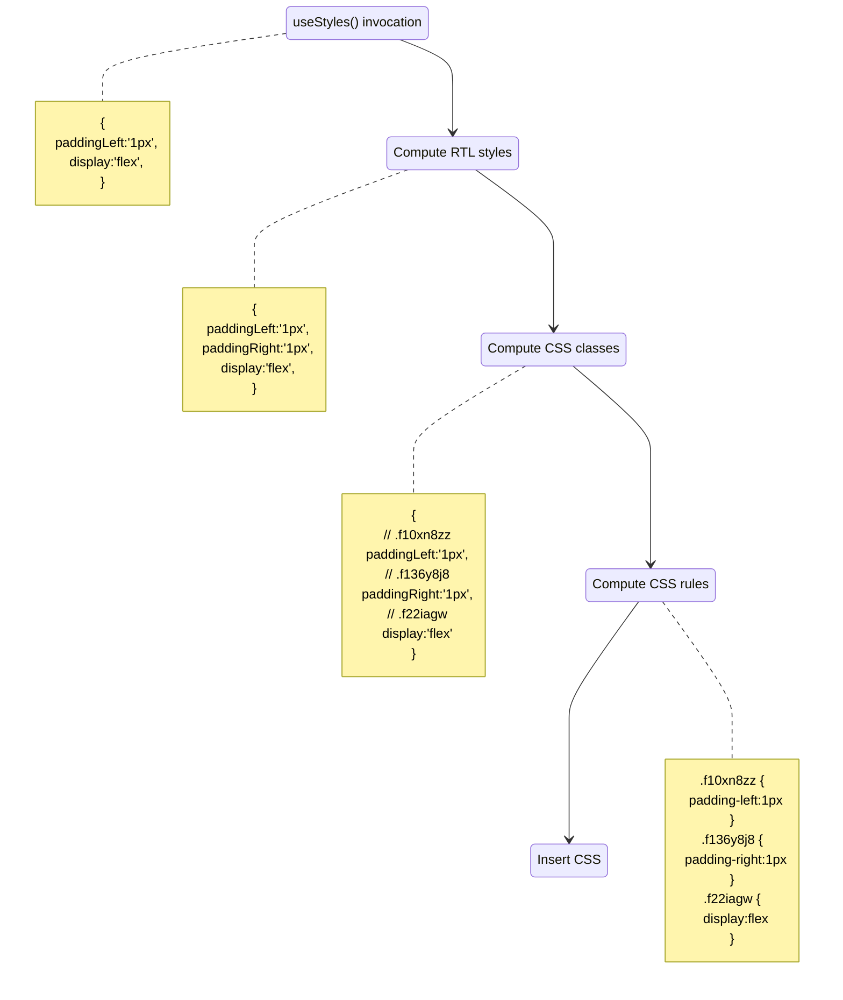

# Technical details

## What is being optimized?

:::info

Style resolution only needs to happen on the initial render of a component. After the first render, styles are cached and reused. Build optimization moves this first-render work to build time.

:::

```jsx
import { makeStyles } from '@griffel/react';

// 1. Invocation of makeStyles creates a styling hook that will be used inside a component.
const useStyles = makeStyles({
  root: { paddingLeft: '1px', display: 'flex' },
});

function Component() {
  // 2. The hook call resolves styles and applies them.
  const classes = useStyles();

  return <div className={classes.root} />;
}
```

You can look at the graph below which describes what work is done during style resolution **at runtime** (without build optimization):



:::note

This work only happens once, during first render.

:::

With build optimization, all of this work is performed at build time. The runtime code of `makeStyles` is completely stripped from the bundle and replaced with a lightweight function (`__css`) that simply concatenates pre-computed CSS classes. The CSS rules are extracted into a separate stylesheet.

The resulting code maps each CSS property to its pre-computed atomic class name. Arrays represent LTR/RTL pairs for bidirectional properties:

```jsx
const useStyles = __css({
  root: {
    mc9l5x: 'f22iagw',
    uwmqm3: ['f10xn8zz', 'f136y8j8'],
  },
});

function Component() {
  // At runtime, __css only concatenates class names — no style resolution needed
  const classes = useStyles();

  return <div className={classes.root} />;
}
```

## Module evaluation process

Style arguments passed to `makeStyles` often reference values from other modules:

```js
// tokens.js
export const PADDING = '1px';
```

```js
// helpers.js
export const flexCenter = () => ({
  display: 'flex',
  justifyContent: 'center',
  alignItems: 'center',
});
```

```js
// styles.js
import { makeStyles } from '@griffel/react';
import { PADDING } from './tokens';
import { flexCenter } from './helpers';

const useStyles = makeStyles({
  root: { paddingLeft: PADDING, ...flexCenter() },
});
```

This is perfectly fine and even encouraged — reusing tokens and style helpers is one of the main benefits of CSS-in-JS. However, it means the build plugin needs to **evaluate** the code to know what styles to transform.

### Two-phase evaluation

`@griffel/transform` uses a two-phase approach to evaluate style expressions:

1. **AST evaluation (fast path)** — statically analyses the AST to resolve simple expressions: literal values, plain objects, template strings without expressions. If the entire style object can be resolved this way, no code execution is needed.

2. **VM evaluation (fallback)** — for expressions that can't be resolved statically (function calls, variable references, dynamic values), the code is executed in a sandboxed Node.js `vm` context. Dependencies are resolved, tree-shaken by `@griffel/transform-shaker` to remove unused code, and then evaluated.

In the example above, `PADDING` and `flexCenter()` are imported values — the AST evaluator can't resolve them statically, so the VM evaluator kicks in, resolves the imports, and executes the code to produce the final style object.
