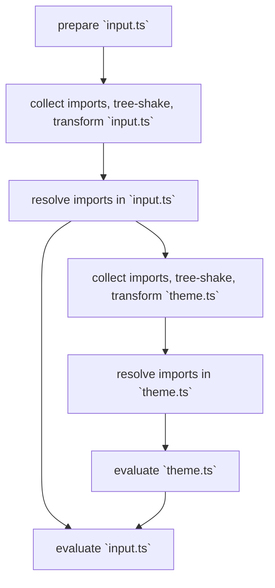
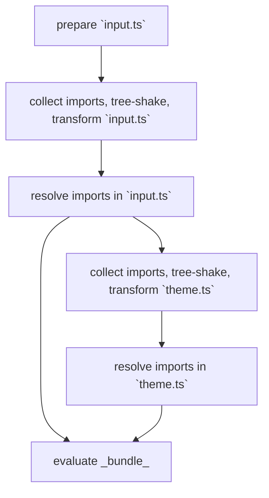

# Improvements to a compiler to make it fast ⚡️

_Authors: [@layershifter](https://github.com/layershifter)_

Griffel features a compiler (available as a Webpack loader, Vite plugin, etc.) that executes [Ahead-of-Time (AOT) compilation](https://griffel.js.org/react/ahead-of-time-compilation/introduction) to enhance runtime performance and shift workload to the build phase. The compiler also enables [CSS extraction](https://griffel.js.org/react/css-extraction/introduction), offering significant performance benefits for applications.

However, we got multiple reports indicate that the compiler's speed is suboptimal. This project seeks to enhance the compiler's performance.

## What the compiler does?

The compiler processes `makeStyles()` & `makeResetStyles()` calls to pre-create CSS rules. For instance:

```jsx
// Input code

const useStyles = makeStyles({
  root: {
    paddingLeft: '1px',
    display: 'flex',
  },
});
```

```jsx
// Output code

const useStyles = __styles(
  {
    root: {
      mc9l5x: 'f22iagw',
      uwmqm3: ['f10xn8zz', 'f136y8j8'],
    },
  },
  {
    d: ['.f22iagw{display:flex;}', '.f10xn8zz{padding-left:1px;}', '.f136y8j8{padding-right:1px;}'],
  },
);
```

See [Griffel.js: Technical details about AOT](https://griffel.js.org/react/ahead-of-time-compilation/technical-details) to get the complete overview.

## How it works?

The complexity in the compiler arises when a `makeStyles()` call includes an imported value from another module. For example:

```jsx
/** @filename `input.ts` */

import { makeStyles } from '@griffel/react';
import { spacing } from './theme';

const useStyles = makeStyles({
  root: { paddingLeft: spacing(1) },
});
```

In this scenario, the context of `input.ts` is insufficient to pre-create CSS rules. The compiler must resolve the `spacing()` function and substitute its call with the actual value.

This introduces complexity. Internally, the compiler functions as a micro-bundler that resolves imports, evaluates expressions, and replaces them with actual values. The simplified lifecycle is below.



Unlike competitors (such as Stylex, [facebook/stylex#112](https://github.com/facebook/stylex/issues/112)), Griffel does not restrict consumers and allows the use of any JavaScript/TypeScript code that does not interact with the DOM. This flexibility introduces challenges in the compiler's performance.

### Step 1: Prepare

This occurs only for files containing a `makeStyles()` call (i.e., an entry point). `exports.__module` is added to the file and will be used for actual evaluation later.

```jsx
// Input code

import { makeStyles } from '@griffel/react';
import { spacing } from './theme';

export const useStyles = makeStyles({
  root: { paddingLeft: spacing(1) },
});
```

```jsx
// Output code

import { makeStyles } from '@griffel/react';
import { spacing } from './theme';

export const useStyles = makeStyles({
  root: { paddingLeft: spacing(1) },
});

exports.__module = [{ root: { paddingLeft: spacing(1) } }];
```

### Step 2: Сollect imports, tree-shake, transform

- Eliminates unused imports, exports, constants, etc.
- Gathers all imports and exports
- Converts code to CommonJS

> **Note: on CommonJS**
>
> While Node.js supports native ESM, its `vm` module (we use for evaluation) has only experimental support for ESM with `--experimental-vm-modules` flag.
> 
> To ensure compatibility, we convert all code to CommonJS.

```jsx
// Input code, `usedExports: ['__module']`

import { makeStyles } from '@griffel/react';
import { spacing } from './theme';

const useStyles = makeStyles({
  root: { paddingLeft: spacing(1) },
});

exports.__module = [{ root: { paddingLeft: spacing(1) } }];
```

```jsx
// Output code

const { spacing } = require('__ABSOLUTE__PATH/theme.ts');

exports.__module = [{ root: { paddingLeft: spacing(1) } }];
```

> **Note: on custom tree-shaking**
>
> The custom tree-shaking algorithm considers the `usedExports` option, ensuring that only the necessary imports are included in the output.
> 
> For instance, if `usedExports: ['spacing']` is specified:
>
> ```jsx
> // Input code, `usedExports: ['spacing']`
>
> export const spacing = value => value + 'px';
> export const colors = { primary: 'red' };
> export const shadows = { small: '1px' };
> ```
>
> ```jsx
> // Output code
>
> exports.spacing = value => value + 'px';
> ```

### Resolve imports

Utilizes the resolving functionality of a compatible bundler (e.g., Webpack, Vite, etc.) to resolve imports.

- The process continues until all imports are resolved.
- Each step is repeated for every file.
- The results of each step are cached.

### Evaluate

Every file gets evaluated i.e. `input.ts`, `theme.ts`, etc. The evaluation is done in Node.js environment using `vm` module i.e.:

```js
// 💡 Not a real code, just an example
const vm = require('vm');
const code = '/* ---- */';

vm.runInContext();
```

As the result, we will get an array of objects that contain actual values:

```jsx
// 💡 Not a real code, just an example
const result = runModule('./input.ts');

console.log(result); // [{ root: { paddingLeft: '1px' }}]
```

## Performance issues

Currently, the compiler in Griffel is using [Linaria v3](https://github.com/callstack/linaria).

### Everything is slow

- The transform step is _slow_ due to using Babel for code transformation.
- The resolving step is _slow_ because a bundler is used to resolve imports.
- The evaluation step is _slow_ because Node.js is used for code evaluation.

### `export *` is the problem 💥

> Generally, `export *` is considered a bad practice for any tooling (Webpack, Jest, Vite, TypeScript, etc.) because it complicates static code analysis as exported members are not known upfront.

Our current algorithm ([Linaria v3](https://github.com/callstack/linaria)) is not well optimized for `export *` statements. When `export *` is encountered, `usedExports` is ignored, and all exports are included in the output for the entire dependency tree.

For instance, all exports from components, theme, and utils are included in the output:

```jsx
// Input code, `usedExports: ['*']`

export * from './components';
export * from './theme';
export * from './utils';
```

```jsx
// Output code

export * from './components';
export * from './theme';
export * from './utils';
```

## `wyw-in-js`

Using [`wyw-in-js`](https://github.com/Anber/wyw-in-js), we attempted to address the performance issue with `export *` statements. The algorithm is more complex but avoids including all exports in the output.

Essentially, it tries to locate the actual export:

```jsx
// Input code, `usedExports: ['spacing']`

export * from './components'; // ❌ will be parsed first to find `spacing`, ignored
export * from './theme'; // ✅ will be parsed first to find `spacing`, used for tree-shaking & evaluation
export * from './utils'; // ❌ will be parsed first to find `spacing`, ignored
```

```jsx
// Output code, `usedExports: ['spacing']`

export { spacing } from './theme';
```

However, since other steps are also slow, the overall performance is still not as good as desired ([Anber/wyw-in-js#69](https://github.com/Anber/wyw-in-js/issues/69)).

Currently, we use `wyw-in-js` in Griffel as a Vite plugin. MUI uses `wyw-in-js` for [Pigment CSS](https://github.com/mui/pigment-css), but they got similar performance issues.

## Could it be faster?

### Experiment A (made by [@layershifter](https://github.com/layershifter))

> Ratio: 70% JS / 30% Rust

During a Hackathon in autumn 2024, I ([@layershifter](https://github.com/layershifter)) created a POC to replace Babel with the OXC parser & transformer. Some changes in the approach were also made.

- OXC parser, transformer & resolver were used (invoked from JS via N-API)
- Some code transformations still occurred in the Node.js environment
- Code was evaluated in the Node.js environment
- `export *` statements were not supported

The results in the real product were promising:

- Current transformer (Linaria v3) - 37.9s
- POC transformer - 4.6s (8x faster)

The POC was not completed, but it demonstrated the potential to make the compiler faster.

### Experiment B (made by [@anber](https://github.com/anber))

> Ratio: 0% JS / 100% Rust

Based on some of my findings, [@anber](https://github.com/anber) created another POC that passed a set of tests from `wyw-in-js` and also implemented injectable transformers.

- OXC parser, transformer & resolver were used (invoked from Rust)
- All code transformations occurred in the Rust environment
- Code was evaluated in the Deno environment
- No cache was implemented

The results on his codebase were:  
- Current CLI (`wyw-in-js`) - 1595ms
- POC CLI - 224ms (7x faster)

This POC also remained as a POC.

## Fast & Furious 🏎️

Our objective is to significantly enhance the compiler's speed, aiming for at least a 10x improvement.

### Changes in tooling

We will adopt Rust as the primary language for the next-gen compiler and use [`napi-rs`](https://github.com/napi-rs/napi-rs) to create Node.js bindings.

#### Parser & transformer

We will replace Babel with the OXC parser & transformer, which is the fastest available, being 3x faster than SWC and 20x-70x faster than Babel.

- https://github.com/oxc-project/bench-javascript-parser-written-in-rust
- https://github.com/oxc-project/bench-transformer

#### Resolver

A fast resolver is also necessary. While we will still offer the option to use a resolver from a bundler (e.g., Webpack, Vite, etc.), we will primarily use the OXC resolver, which is 28x faster than Webpack's resolver.

- https://github.com/oxc-project/bench-resolver

#### Evaluation

We will experiment with using the Deno/Bun runtime for code execution, which should be faster than Node.js.

> Note: Initial experiments indicated that Node.js was faster for running code than Deno.

### Changes in approach

We will also optimize the steps in our approach to further accelerate the compiler.



#### Strict mode (performance mode)

We will introduce a strict mode that disables certain features to enhance compiler speed. For instance, this mode will not support `export *` and CommonJS modules.

**This mode will be implemented first.**

#### Module evaluation

We will no longer evaluate modules on the go. Instead, we will evaluate all modules at once, similar to a bundle. We will use an approach inspired by Webpack, where after processing steps, we will evaluate:

```js
// Output code

const fn = () => {
  function require(moduleId) {
    /* ---- */
  }

  function __wd40_module(filename, fn) {
    /* ---- */
  }

  __wd40_module('/theme.ts', function (module, exports, require) {
    exports.spacing = value => value + 'px';
  });

  __wd40_module('/input.ts?entrypoint', function (module, exports, require) {
    const { spacing } = require('/theme.ts');

    exports.__module = [{ root: { paddingLeft: spacing(1) } }];
  });

  return require('/input.ts?entrypoint');
};
```
